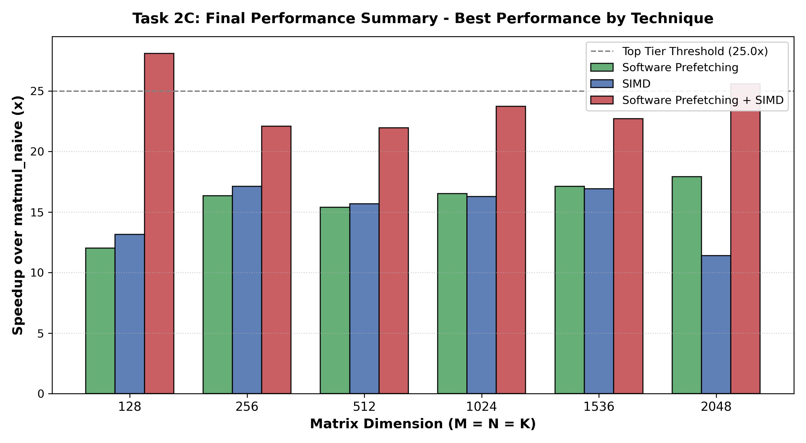

# High-Performance GEMM for LLM Inference

Hand-optimized single-precision matrix multiplication (SGEMM) and 2D convolution kernels for x86 CPUs, written with AVX2 intrinsics and cache-aware blocking. No compiler auto-vectorization, no BLAS, no threading: every speedup comes from matching the code to the microarchitecture.

The SGEMM kernel uses the non-transposed × transposed layout of [ggml](https://github.com/ggerganov/ggml) / [llama.cpp](https://github.com/ggerganov/llama.cpp), where both operands are read along rows:

```
C[i·ldc + j] = Σₚ A[i·lda + p] · B[j·ldb + p]
```

## Results

All numbers are single-threaded, measured against a naive triple-loop baseline on an Intel Core Ultra 7 155H (Meteor Lake P-core).

### SGEMM

| Kernel | 1024³ | Speedup | 2048³ | Speedup |
| --- | --- | --- | --- | --- |
| Naive baseline | 490.14 ms | 1.00× | 4514.55 ms | 1.00× |
| AVX2, unblocked | 30.12 ms | 16.27× | 396.08 ms | 11.40× |
| Cache blocking + prefetch | 29.66 ms | 16.53× | 251.95 ms | 17.92× |
| **Register tiling + blocking + prefetch** | **20.66 ms** | **23.73×** | **176.33 ms** | **25.60×** |

The optimized kernel sustains about **101 GFLOP/s** at 1024³, roughly 65% of one P-core's theoretical AVX2 FMA peak.

The unblocked SIMD kernel *loses* speedup as the problem grows (16.27× → 11.40×) because the 48 MB working set spills out of cache. Blocking reverses that trend.

### Cache behaviour (perf, N = 1024)

| Counter | Without prefetch | With prefetch | Change |
| --- | --- | --- | --- |
| L1-D load misses | 7.18 M | 681 k | −90% |
| LLC load misses | 49.4 k | 22.4 k | −55% |

### 2D convolution (K = 3)

| Size | Naive | AVX2 | Speedup |
| --- | --- | --- | --- |
| 256 × 256 | 0.618 ms | 0.042 ms | 14.71× |
| 1024 × 1024 | 6.749 ms | 0.613 ms | 11.01× |
| 2048 × 2048 | 15.990 ms | 3.533 ms | 4.53× |

16×128 cache tiling reduced L1-D MPKI from 21.4 to 2.7 (−87%).

<!-- Add plots here, e.g. -->
<!--  -->

## How it works

**4×3 register-tiled micro-kernel.** Each step holds a 4×3 block of C in 12 YMM accumulators, with 3 registers for B and 1 for A. That uses all 16 architectural YMM registers with no spills and gives 7 loads per 12 FMAs, keeping both FMA ports fed.

**Cache blocking.** N is blocked at 144 and M at 128. At K = 1024, one B panel is 576 KB and stays resident in the 2 MiB L2 while it is reused across 128 rows of A.

**Software prefetching.** `_mm_prefetch` with the `T0` hint, 32–48 floats (2–3 cache lines) ahead, issued on B only. A sweep over distances 0–256 floats and all four locality hints (T0/T1/T2/NTA) found T0 best, since the data is consumed immediately by `_mm256_fmadd_ps`.

**GEMV fast path.** A dedicated path for M = 1, the shape of autoregressive token generation, processes four rows of B against a single row of A.

### What didn't work, and why

- **Software prefetch barely moved execution time** on top of blocking, despite the large miss reductions. The hardware L2 streamer already covers these unit-stride streams. Disabling hardware prefetchers via MSR `0x1A4` confirms they carry most of the latency hiding.
- **Loop reordering and scalar tiling in convolution were slower at 2048×2048** (0.88× and 0.43×). Reordering sweeps a 16 MB output array K² times, and scalar tiling removes a memory bottleneck that wasn't the binding one. Tiling only paid off once SIMD removed the arithmetic bottleneck.

## Repository layout

```
task2/src/
  matmul_simd.cpp        AVX2 SGEMM (4×2 register tile)
  matmul_prefetch.cpp    Blocked SGEMM with software prefetching
  matmul_optimized.cpp   Register tiling + blocking + prefetch + GEMV path
task1/src/
  conv_reorder.cpp       Loop reordering
  conv_unroll.cpp        Loop unrolling
  conv_tile.cpp          Cache tiling
  conv_simd.cpp          AVX2 vectorization
  conv_optimized.cpp     Tiling + AVX2 + 4-way unrolling
plots/                   Figures referenced above
```

## Build and run

Requires an x86-64 CPU with AVX2 and FMA, GCC or Clang, and Linux (`perf` for profiling).

```bash
make
./bin/matmul optimized 1024 1024 1024
./bin/conv
```

Compiled with `-std=c++17 -O2 -fno-tree-vectorize -mavx2 -mfma`. `-fno-tree-vectorize` disables compiler auto-vectorization so all measured speedups come from the hand-written kernels.

Profiling example:

```bash
perf stat -e L1-dcache-load-misses,l2_rqsts.miss,LLC-load-misses,sw_prefetch_access.t0 \
    ./bin/matmul prefetch 1024 1024 1024
```

## Acknowledgements

Originally developed as part of CS683 (Advanced Computer Architecture) at IIT Bombay, with [teammate names]. Base code and benchmark harness provided by the course staff.
